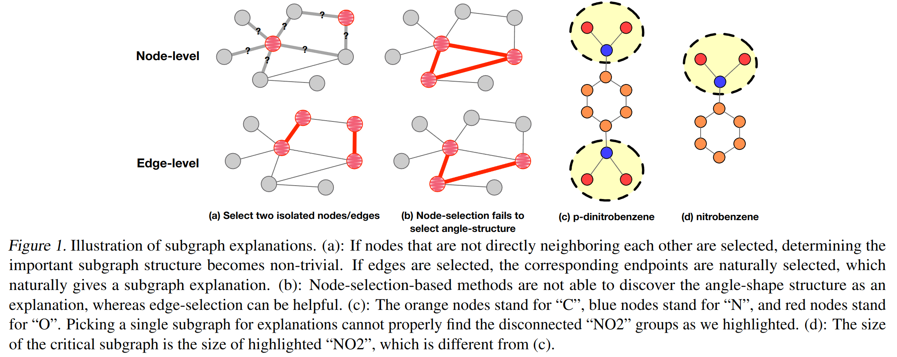

# EiG-Search: Generating Edge-Induced Subgraphs for GNN Explanation in Linear Time 
[[OpenReivew]](https://openreview.net/forum?id=HO0g6cHVZx) [[Arxiv]]()

### Run Our Code:
> $ python3 --dataset ba_2motifs --gnn gin --sparsity 0.7 --do_plot 0 --linear_search 1

**Graph classificiation dataset options**: ba_2motifs, Mutagenicity, MUTAG, NCI1

**Node classificiation dataset options**: ba_shape, ba_communicity, trid_grid

**GNN varients**: gin, gcn, sage

**Sparsity range**: 0.0~1.0 (For graph classificiation)

**Topk values**： even integers (For node classificiation)

**do_plot**: 1 if want to visualize, else 0

**linear_search**: 1 if turn on linear time search module, else 0

### Environment:
>CUDA                      11.3 
python                    3.9.18 
pytorch                   1.11.0           
pytorch-cluster           1.6.0            
pytorch-cuda              11.8             
pytorch-memlab            0.3.0            
pytorch-mutex             1.0              
pytorch-scatter           2.0.9            
pytorch-sparse            0.6.15           
pyg                       2.1.0 
numpy                     1.26.3 
ninja                     1.10.2               
networkx                  3.2.1 
